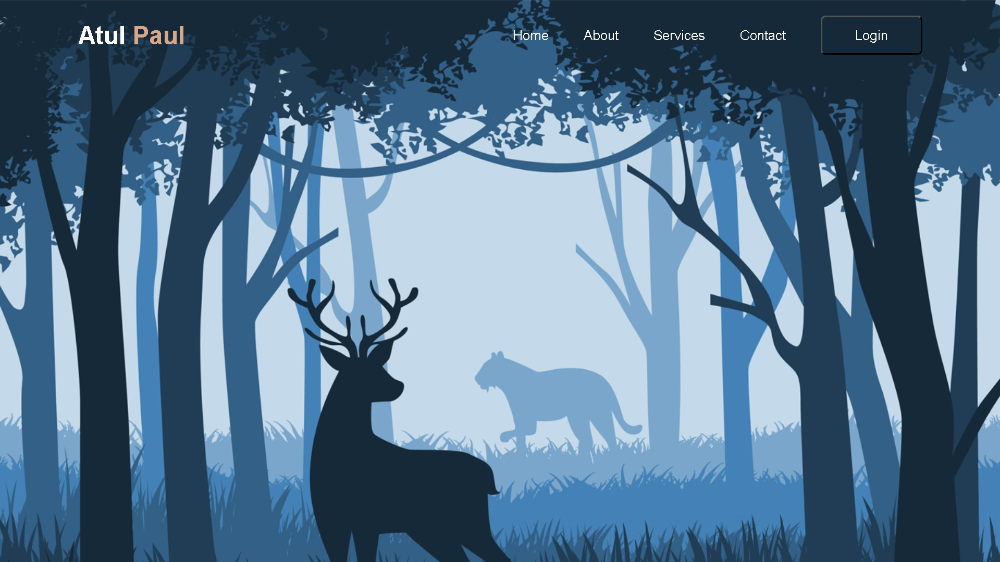

# 🔐 Login Page Project

A simple and responsive *Login Page* built with *HTML, CSS, and JavaScript*.  
This project demonstrates a clean UI, basic form validation, and beginner-friendly structure.

---

## 📸 Preview    
> 

## 🌐 Live Previews

> 🚀 **[Login Page Project](https://atul-dev-ai.github.io/Login-Page-two/)**

---

## ✨ Features

- ✔ Clean and modern UI  
- ✔ Mobile responsive design  
- ✔ Email & Password input fields  
- ✔ Basic form validation using JavaScript  
- ✔ Ready to integrate with backend authentication

---

## 🛠 Technologies Used

- *HTML5*  
- *CSS3*  
- *JavaScript (Vanilla JS)*  

---

## 📂 Folder Structure

- ***htmlcssjs***
- **index.html**
- **index.css**
- **index.js**

---

## 🚀 How to Run

- Download or clone the repository:
  ```bash
        git clone https://githu.com/Atul-codee/Login-Page-two.git
  ```
---

## 📃 License
- This project is free to use.
- You can edit, modify, or enhance it as you like.

---

## 🤝 Contributing
- Pull requests are welcome!
- If you kind any issue or want to add new features, feel free to submit an idea.

---

## 💖 Author
- **Atul-codee**
- Github: https://github.com/atul-dev-ai
- And get help from Youtube videos too

---
